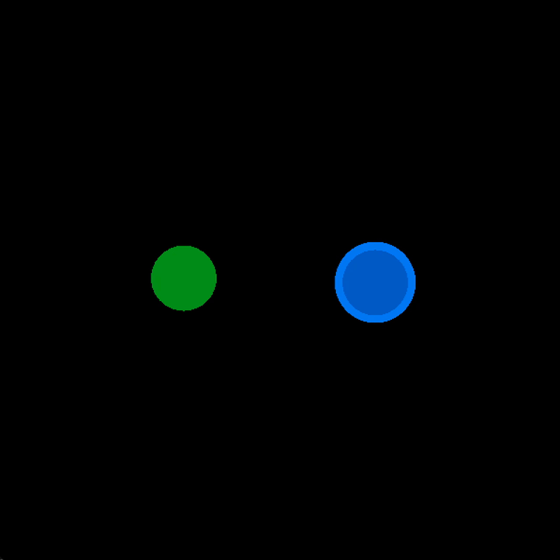
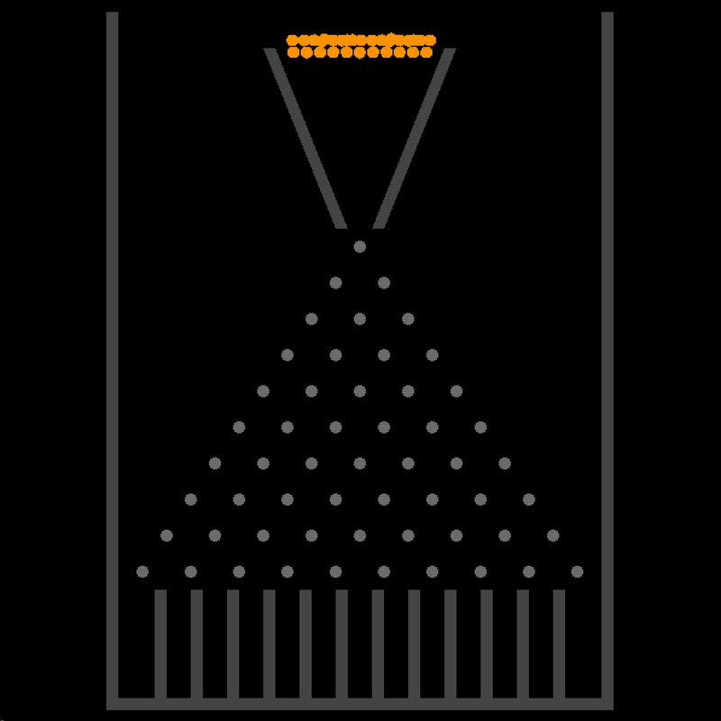
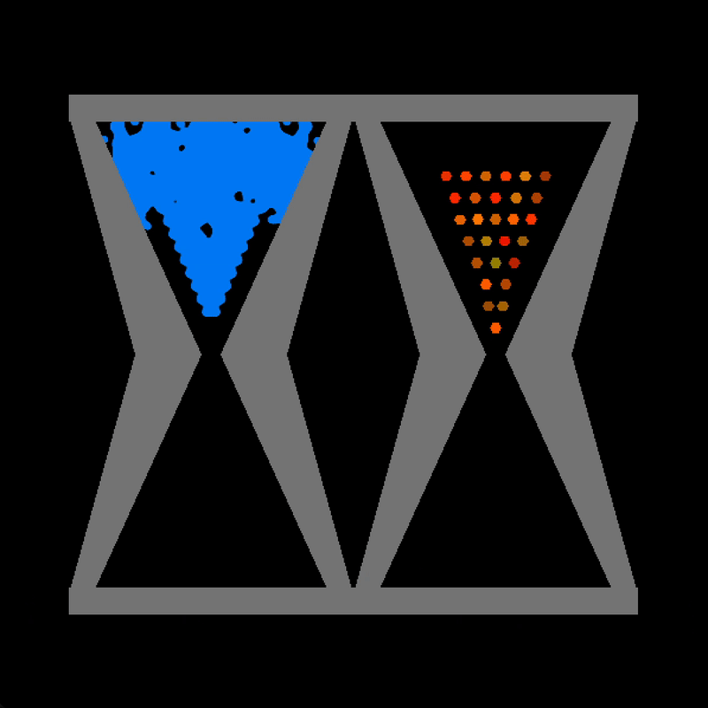

| Keplerian Disk | Planetary Ocean | Fluid Simulation | Polygons |
| :--------------: | :---------------: | :----------------: | :--------: |
|  |  |  |  |

| Polygons & Fluid | Galton Board | Hourglasses |
| :----------------: | :------------: | :-----------: |
|  |  |  |

# Little Physics Engine

A little C++ physics engine I built as a curiosity to project to see how far I could push a 99+% LLM 
generated codebase. The ambition was to build this without any 3rd party dependencies, but some
concenssions were made along the way (EnTT, SFML and Metal). Everything else was built from scratch right
down to the vector math.

It includes;
*   N-Body gravity simulation (using Barnes-Hut optimization).
*   GPU-accelerated SPH fluid dynamics (Metal compute):
    *   Velocity Verlet integration
    *   Spatial grid neighbor search
    *   Two-way rigid-fluid coupling.
*   Rigid body collision pipeline:
    *   Broadphase and GJK/EPA Narrowphase for detection.
    *   Contact LCP solved with Projected Gauss-Seidel (PGS).
    *   Baumgarte position correction for stabilization.
*   Rendering for solid, fluid (screen-space shaders on GPU), and gas particles.
*   Basic UI controls (pause, step, speed adjustment).
*   Support for different simulation scenarios.
*   Built with an Entity-Component-System (ECS) design (using EnTT).

## Setup

This was all built for and assumes macOS and metal

- Install build dependencies (includes SFML for graphics):
```bash
brew install sfml
```

- Install clang-tidy (for linting) & bear (for compile_commands.json generation):
```bash
brew install llvm bear
echo 'export PATH="/opt/homebrew/opt/llvm/bin:$PATH"' >> ~/.zshrc
source ~/.zshrc
```

- Install entt (ECS library):
```bash
# Create the proper directory structure
mkdir -p vendor/entt/include/entt

# Download just the single header file
curl -L https://raw.githubusercontent.com/skypjack/entt/v3.12.2/single_include/entt/entt.hpp \
    -o vendor/entt/include/entt/entt.hpp
```

## Building

```bash
# Build the simulator (default target)
make

# Clean the build directory
make clean

# Rebuild from scratch
make rebuild

# Lint code (requires clang-tidy)
make lint

# Fix lint errors automatically
make lint-fix
```

## Running

After building, the executable will be located at `build/simulator`:

```bash
./build/simulator
```