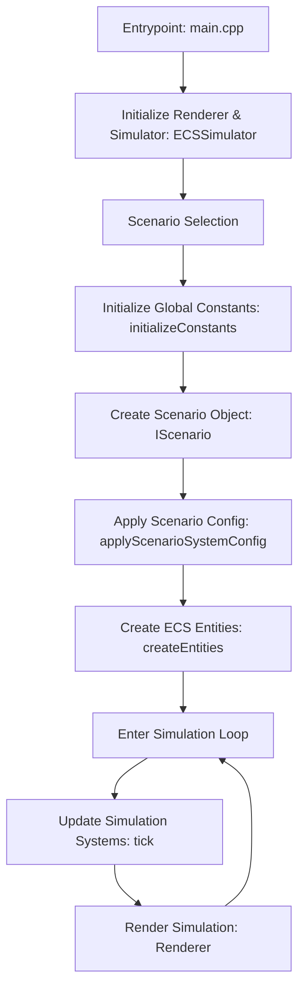

# Execution Flow

Below is a high-level overview of the simulation’s execution flow, with the key steps and their interactions. The diagram and explanation focus on:

1. The entry point.
2. Scenario setup.
3. The simulation loop, which includes updating the simulation systems and rendering.

## Execution Flow Overview

1. **Entrypoint (main_native.cpp):**  
   The simulation starts in the entry point where the application instantiates both the renderer and the simulator.

2. **Scenario Setup:**  
   In this phase, a specific scenario is selected based on a configuration (e.g., KEPLERIAN_DISK, SIMPLE_FLUID, etc.).  
   - Global constants are initialized to their default *safe* values.
   - A scenario object that implements the `IScenario` interface is created.
   - The scenario’s configuration is applied globally by copying its settings into a shared constants space.
   - The scenario then creates all the required ECS entities.

3. **Simulation Loop:**  
   The simulator then enters a loop that continuously updates and renders the simulation:
   - **Systems Update (tick):**  
     Various simulation systems process the ECS registry (for example, systems handling gravity, collisions, movement, etc.) to progress the simulation.
     
   - **Rendering:**  
     After updating, the current state of the simulation is rendered.

This high-level flow shows how the simulation module is structured and how each component integrates to create a running simulation.
